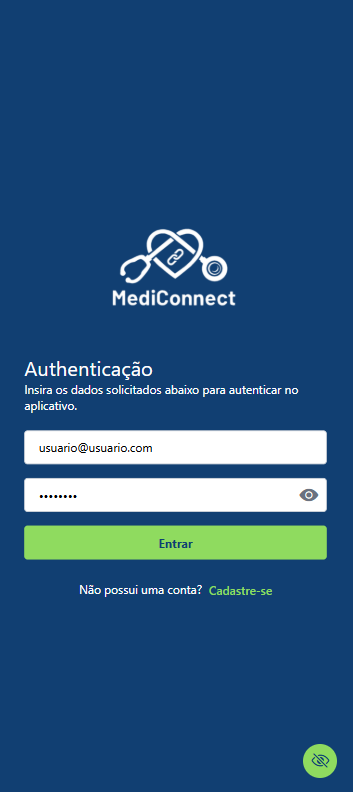
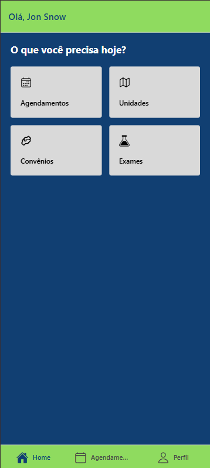
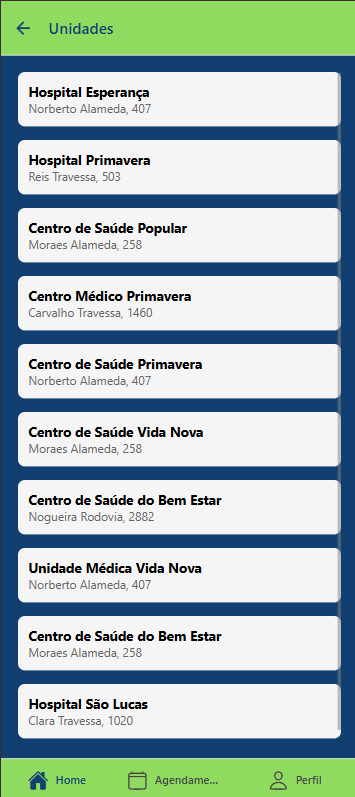
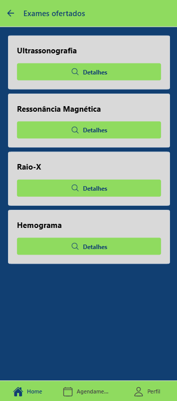
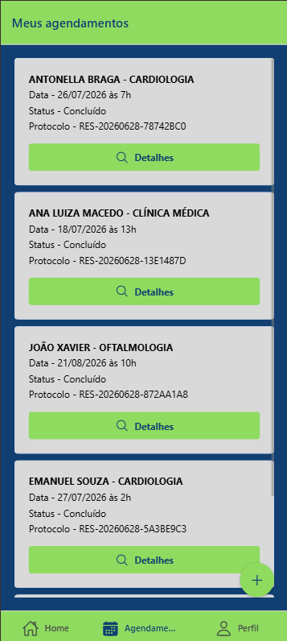
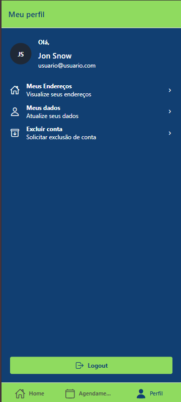

# 🏥 MediConnect 

<p align="center">
  
  
  
</p>

<p align="center">
  
  
  
</p>

**MediConnect** é um sistema completo para **agendamento de consultas médicas**, dividido em dois projetos:

* Um **backend** desenvolvido em **ASP.NET Core MVC**, responsável pela API RESTful e lógica de negócio.
* Um **aplicativo mobile** criado com **React Native + Expo**, com arquitetura modular.

O objetivo do projeto é oferecer uma solução integrada que permita:

* **Usuários**: Cadastrar-se e realizar agendamentos de consultas médicas de forma simplificada.
* **Administradores**: Gerenciar as funcionalidades do aplicativo em uma área restrita.

 
---

## 🌐 Backend - ASP.NET Core MVC (`/webapi`)

### 📌 Tecnologias Utilizadas

| Tecnologia                | Função                                                  |
| ------------------------- | ------------------------------------------------------- |
| **ASP.NET Core 8**        | Framework principal para a construção da Web API.       |
| **Entity Framework Core** | ORM para persistência de dados relacionais.             |
| **JWT Authentication**    | Implementação de autenticação via tokens.               |
| **Swagger / Swashbuckle** | Geração de documentação interativa para testes da API.  |

### 🧱 Arquitetura: MVC

O backend segue o padrão **Model-View-Controller (MVC)** adaptado para APIs RESTful:

```
webapi/
├── Controllers/       # Lida com requisições HTTP e direciona para os serviços
├── Models/            # Representações das entidades do domínio (EF Core)
├── DTOs/              # Objetos de transferência de dados
└── Repositories/       # Regras de validação com FluentValidation
```

### 🔐 Segurança

* Autenticação baseada em **JWT**.
* Controle de acesso com `[Authorize]`, incluindo roles (paciente, admin).
* Tokens armazenam tipo de usuário para controle de rotas.

---

## 📱 Aplicativo Mobile - React Native (`/mobileapp`)

### 📌 Tecnologias Utilizadas

| Tecnologia           | Função                                                           |
| -------------------- | ---------------------------------------------------------------- |
| **React Native**     | Framework para desenvolvimento nativo com JavaScript/TypeScript. |
| **Expo**             | Plataforma para simplificar o desenvolvimento, build e testes.   |
| **TypeScript**       | Tipagem estática para maior confiabilidade.                      |
| **Axios**            | Cliente HTTP para consumo da API.                                |
| **Expo router**   | Gerenciamento de rotas e navegação entre telas.                  |
| **NativeWind**       | Estilização com utilitários baseados no Tailwind CSS.            |
| **Context API**      | Gerenciamento de estados globais (como autenticação e usuário).  |
| **AsyncStorage**     | Armazenamento local dos dados como token JWT.                    |

### 🧱 Arquitetura Modular

O projeto é organizado de forma modular, favorecendo **manutenção, separação de responsabilidades e escalabilidade**:

```
mobileapp/
├── assets/              # Imagens, fontes e outros recursos estáticos
├── components/          # Componentes reutilizáveis (botões, cards, inputs)
├── contexts/            # Contextos globais (ex: AuthContext)
├── services/            # Serviços de API (ex: auth, agendamentos, clínicas)
├── pages/               # Telas do app (Login, Cadastro, Home, Admin)
├── app/                 # Configurações de rotas e navegação
└── utils/               # Funções utilitárias (ex: formatação de datas)
```

### 📲 Funcionalidades

#### Usuário (Paciente)

* Cadastro e login com autenticação via JWT
* Agendamento de consulta
* Visualizar exames
* Visualizar convênios aceitos
* Visualizar unidades médicas
* Visualizar unidades Dados do usuário logado
* Cadastrar endereço do usuário
* Histórico de agendamentos
* Avaliação pós consulta

#### Administrador

* Autenticar no sistema
* Gerenciamento de usuário
* Gerenciamento de administradores
* Gerenciamento de unidades
* Gerenciamento de médicos
* Gerenciamento de especialização
* Gerenciamento de exames
* Gerenciamento de convênios
* Gerenciamento de agendamentos

---

## 🛠️ Como Executar o Projeto

### Pré-requisitos

* [.NET 8 SDK](https://dotnet.microsoft.com)
* [Node.js](https://nodejs.org/)
* [Expo CLI](https://docs.expo.dev/get-started/installation/)
* [Visual Studio 2022+](https://visualstudio.microsoft.com/)
* SQL Server ou SQLite

### 1. Clonar o repositório

```bash
git clone https://github.com/marcellyfreitas/mediconnect.git
cd mediconnect
```

### 2. Executar a API

```bash
cd webapi
dotnet ef database update
dotnet run
```

A API estará disponível em `https://localhost:5001`.

### 3. Executar o app mobile

```bash
cd mobileapp
npm install
npm start
```

Use o **Expo Go** para escanear o QR code ou um emulador Android/iOS.

---

## 📚 Documentação da API

Após iniciar a aplicação, acesse:

```
https://localhost:5001/swagger
```

* A documentação interativa via **Swagger** permite testar todos os endpoints com facilidade.

---

## ✅ Funcionalidades Implementadas

* [x] Cadastro/Login com autenticação via JWT (usuário e admin)
* [x] CRUD de usuários e administrador, exames, convênios, unidades, especialidades, endereços e médicos (admin)
* [x] Agendamento de consultas
* [x] Cadastro do endereço do usuário
* [x] Gerenciar dados do usuário altenticado
* [x] Funcionalidade de cancelar conta
* [x] Visualizar unidades

---

## 🚧 Melhorias Futuras

* [ ] Visualizar exames
* [ ] Visualizar convênios
* [ ] Implenmentar banco de dados não relacional
* [ ] Criar build para deploy do aplicativo
* [ ] Deploy do backend no smarterASP

---

## 👩‍💻 Autora

Desenvolvido por **Marcelly Freitas**
🔗 [github.com/marcellyfreitas](https://github.com/marcellyfreitas)

---
